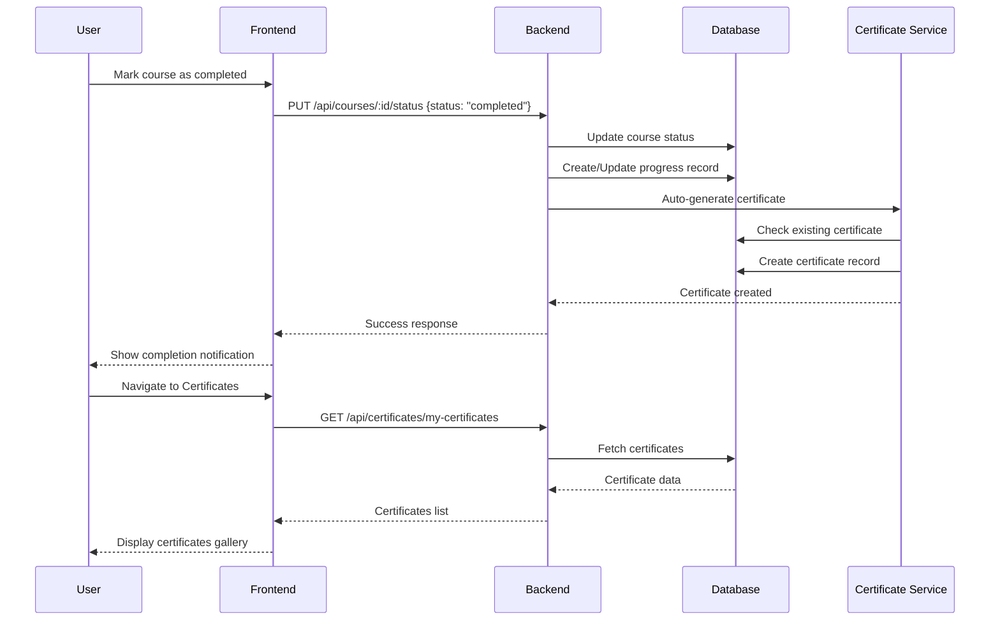

# 🎓 Automatic Certificate Generation System

## Overview

EduKanban now features an advanced automatic certificate generation system that creates beautiful, professional certificates when learners complete their courses. Each certificate includes the learner's achievement percentage and grade, along with a QR code for verification.

---

## ✨ Features

### 1. **Automatic Generation**
- Certificates are automatically generated when a course status is changed to "completed"
- No manual intervention required
- Instant availability after course completion

### 2. **Achievement Metrics**
- **Completion Percentage**: Calculated based on course progress and quiz scores
  - 60% weight on course completion
  - 40% weight on quiz scores (if available)
- **Letter Grade**: Assigned based on overall achievement
  - A+ (Outstanding): 95-100%
  - A (Excellent): 90-94%
  - A- (Very Good): 85-89%
  - B+ (Good): 80-84%
  - B (Above Average): 75-79%
  - B- (Average): 70-74%
  - C+ (Satisfactory): 65-69%
  - C (Pass): 60-64%

### 3. **Professional Design**
The certificate template includes:
- **Modern Layout**: A4 landscape format with decorative borders
- **Gradient Accents**: Purple, pink, and blue color scheme
- **Elegant Typography**: Professional font hierarchy
- **Decorative Elements**: Corner accents and geometric patterns
- **QR Code**: For instant verification
- **Unique Certificate ID**: Format `EDUKANBAN-[timestamp]-[random]`

---

## 🎨 Certificate Template Design

### Visual Elements

```
┌─────────────────────────────────────────────────────────────┐
│  ╭─────────╮                                                 │
│  │   EK    │  EDUKANBAN                                      │
│  ╰─────────╯  ━━━━━━━━━━                                    │
│                                                               │
│              Certificate of Achievement                       │
│                                                               │
│         ━━━━  This is to certify that  ━━━━                 │
│                                                               │
│                    [Student Name]                             │
│         ─────────────────────────────────────                │
│                                                               │
│          has successfully completed the course                │
│                                                               │
│                  [Course Title]                               │
│                                                               │
│      ┌──────────┐           ┌──────────┐                    │
│      │  XX.X%   │           │  Grade   │                    │
│      │Achievement│           │   A+     │                    │
│      └──────────┘           └──────────┘                    │
│                                                               │
│            Completed on [Date]                                │
│            Course Duration: [Duration]                        │
│                                                               │
│  ─────────────          ─────────────         ┌─────┐       │
│  EduKanban Platform     [Issue Date]          │ QR  │       │
│  Authorized Platform    Issue Date            │Code │       │
│                                                └─────┘       │
│  Certificate ID: EDUKANBAN-XXXX-XXXX                        │
│  edukanban.com/verify                                        │
└─────────────────────────────────────────────────────────────┘
```

### Color Palette
- **Primary Purple**: `#8b5cf6` - Main accents and borders
- **Light Purple**: `#a78bfa` - Secondary accents
- **Pale Purple**: `#c4b5fd` - Tertiary elements
- **Dark Gray**: `#1f2937` - Primary text
- **Medium Gray**: `#4b5563` - Secondary text
- **Light Gray**: `#6b7280` - Tertiary text

---

## 🔧 Technical Implementation

### Backend Structure

```
backend/
├── models/
│   ├── Certificate.js         # Certificate data model
│   └── Progress.js             # Course progress tracking
├── routes/
│   ├── certificates.js         # Certificate API endpoints
│   └── courses.js              # Course management (with auto-cert)
└── utils/
    └── certificateTemplate.js  # Premium certificate template
```

### API Endpoints

#### 1. Generate Certificate (Manual)
```http
POST /api/certificates/generate/:courseId
Authorization: Bearer {token}
```

**Response:**
```json
{
  "success": true,
  "certificate": {
    "certificateId": "EDUKANBAN-1697836800000-A1B2C3D4",
    "verificationCode": "abc123...",
    "grade": "A (Excellent)",
    "percentage": 92.5
  }
}
```

#### 2. Get My Certificates
```http
GET /api/certificates/my-certificates
Authorization: Bearer {token}
```

**Response:**
```json
{
  "success": true,
  "certificates": [
    {
      "_id": "...",
      "certificateId": "EDUKANBAN-...",
      "courseName": "Introduction to React",
      "grade": "A (Excellent)",
      "percentage": 92.5,
      "issueDate": "2025-10-17T...",
      "completionDate": "2025-10-16T..."
    }
  ]
}
```

#### 3. Verify Certificate
```http
GET /api/certificates/verify/:verificationCode
```

**Response:**
```json
{
  "success": true,
  "certificate": {
    "certificateId": "EDUKANBAN-...",
    "userName": "John Doe",
    "courseName": "Introduction to React",
    "issueDate": "2025-10-17",
    "grade": "A (Excellent)",
    "percentage": 92.5,
    "isValid": true
  }
}
```

---

## 🚀 Usage Guide

### For Learners

#### Completing a Course
1. Complete all course modules and lessons
2. Mark the course as "completed" in your dashboard
3. Certificate is automatically generated
4. Access certificates from the "Certificates" section

#### Viewing Certificates
1. Navigate to **Dashboard → Certificates**
2. View all earned certificates in a gallery format
3. Click on any certificate to download PDF
4. Share certificates on social media

#### Sharing Certificates
- Download PDF and share directly
- Share verification link: `edukanban.com/verify/{code}`
- Add to LinkedIn profile (verification URL)
- Print for physical display

### For Developers

#### Triggering Automatic Generation

The certificate is automatically generated when:

```javascript
// Update course status to completed
await Course.findByIdAndUpdate(courseId, {
  status: 'completed',
  completedAt: new Date()
});

// Progress is automatically updated
// Certificate is auto-generated via webhook
```

#### Manual Certificate Generation

```javascript
const certificateRoutes = require('./routes/certificates');

// Generate certificate manually
const certificate = await certificateRoutes.autoGenerateCertificate(
  userId,
  courseId
);
```

#### Customizing the Template

Edit `/backend/utils/certificateTemplate.js`:

```javascript
// Modify colors
doc.rect(0, 0, width, height)
   .fill('#your-color');

// Change fonts
doc.fontSize(48)
   .font('Your-Font')
   .text('Your Text');

// Add custom elements
doc.image('logo.png', x, y, {
  width: 100,
  height: 100
});
```

---

## 📊 Certificate Data Model

```javascript
{
  user: ObjectId,              // Reference to User
  course: ObjectId,            // Reference to Course
  certificateId: String,       // Unique: EDUKANBAN-timestamp-random
  verificationCode: String,    // Unique hex string for verification
  userName: String,            // Full name of learner
  courseName: String,          // Course title
  issueDate: Date,            // When certificate was issued
  completionDate: Date,       // When course was completed
  duration: String,           // Course duration (e.g., "4 weeks")
  grade: String,              // Letter grade (e.g., "A (Excellent)")
  percentage: Number,         // Achievement percentage (0-100)
  skills: [String],           // Array of learned skills
  template: String,           // Template version used
  isRevoked: Boolean,         // Revocation status
  revokedAt: Date,           // Revocation timestamp
  revokedReason: String      // Reason for revocation
}
```

---

## 🔐 Security & Verification

### QR Code Verification
Each certificate includes a QR code that:
- Links to verification page
- Contains encrypted verification code
- Uses high error correction level
- Custom purple color scheme

### Verification Process
1. Scan QR code or visit verification URL
2. System validates verification code
3. Displays certificate details:
   - Certificate ID
   - Learner name
   - Course name
   - Issue and completion dates
   - Grade and percentage
   - Validity status

### Anti-Fraud Measures
- Unique certificate IDs with timestamps
- Cryptographically secure verification codes
- Database cross-reference validation
- Revocation capability for fraudulent certificates

---

## 📱 Frontend Integration

### Certificates Page Component

```javascript
import CertificatesPage from './components/CertificatesPage';

<CertificatesPage 
  token={userToken}
  user={currentUser}
/>
```

### Features
- Gallery view of all certificates
- Filter by course/date
- Search functionality
- Download as PDF
- Share on social media
- View certificate details
- QR code display

---

## 🎯 Automatic Generation Workflow



---

## 🛠️ Configuration

### Environment Variables

```env
# Certificate generation
FRONTEND_URL=http://localhost:3000
CERTIFICATE_TEMPLATE=premium

# PDF generation
PDF_QUALITY=high
PDF_COLOR_SPACE=RGB

# QR code settings
QR_ERROR_CORRECTION=H
QR_SIZE=100
QR_COLOR=#8b5cf6
```

### Server Configuration

```javascript
// backend/server.js
const certificateRoutes = require('./routes/certificates');

app.use('/api/certificates', authMiddleware, certificateRoutes);
```

---

## 📈 Analytics

### Certificate Metrics

Track certificate issuance:
- Total certificates issued
- Certificates per course
- Average achievement percentage
- Grade distribution
- Verification requests
- Share rate

---

## 🔄 Future Enhancements

### Planned Features
1. **Multiple Templates**: Choose from different certificate designs
2. **Custom Branding**: Add institution logos and colors
3. **NFT Certificates**: Blockchain-based verification
4. **Badge Integration**: Link badges to certificates
5. **LinkedIn API**: Auto-post to LinkedIn
6. **Email Delivery**: Automatic email with certificate PDF
7. **Print Service**: Professional printing and mailing
8. **Signature Integration**: Digital signatures from instructors
9. **Multi-language**: Certificates in multiple languages
10. **Certificate Levels**: Basic, intermediate, advanced certificates

---

## 💡 Best Practices

### For Course Creators
- Set clear completion criteria
- Include meaningful course duration
- Add relevant tags for skills section
- Maintain high-quality content

### For Platform Administrators
- Regularly verify certificate integrity
- Monitor for fraudulent certificates
- Keep verification system updated
- Backup certificate database

### For Learners
- Complete all course requirements
- Download certificates immediately
- Keep verification codes secure
- Share certificates professionally

---

## 🐛 Troubleshooting

### Common Issues

**Issue: Certificate not generating automatically**
- Check if course status is set to "completed"
- Verify progress record exists
- Check server logs for errors
- Ensure database connection is active

**Issue: QR code not working**
- Verify FRONTEND_URL environment variable
- Check verification endpoint is accessible
- Ensure QRCode library is installed
- Test verification URL manually

**Issue: PDF download failing**
- Check PDFKit installation
- Verify file permissions
- Ensure sufficient disk space
- Check browser PDF viewer settings

**Issue: Incorrect percentage calculation**
- Verify progress.completionPercentage is accurate
- Check quiz scores are recorded correctly
- Ensure calculation logic is correct
- Review grade boundaries

---

## 📚 Resources

### Dependencies
- **pdfkit**: PDF generation library
- **qrcode**: QR code generation
- **crypto**: Secure random code generation
- **mongoose**: Database ORM

### Documentation Links
- [PDFKit Documentation](http://pdfkit.org/)
- [QRCode Library](https://github.com/soldair/node-qrcode)
- [Node.js Crypto](https://nodejs.org/api/crypto.html)

---

## 🎉 Success Stories

> "The automatic certificate generation saved us countless hours. Our learners love the professional design!" - Course Creator

> "The QR code verification gives our certificates credibility. Employers can instantly verify them." - Platform Administrator

> "I proudly display my EduKanban certificate on LinkedIn. The design is beautiful!" - Learner

---

## 📞 Support

For issues or questions:
- Check troubleshooting section above
- Review code comments in `certificateTemplate.js`
- Contact development team
- Submit GitHub issue

---

## 📄 License

This certificate generation system is part of the EduKanban platform.
© 2025 EduKanban. All rights reserved.

---

**Built with ❤️ for learners worldwide**

*Last Updated: October 17, 2025*
